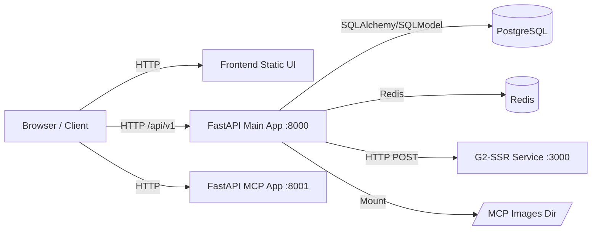
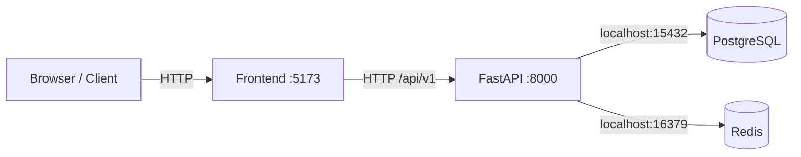

# mySQLBot 系统架构（当前实现）

本文档描述当前仓库代码对应的系统架构实现，用于研发、排障与后续演进。

## 1. 架构总览

mySQLBot 支持两套部署模式：**开发环境** 和 **生产环境**。

### 1.1 生产环境架构

生产环境采用 **单容器多进程（All-in-One）** 架构：

- 前端静态资源（Vue3 + Vite build 产物）
- 后端主服务（FastAPI，端口 8000）
- MCP 服务（FastAPI MCP，端口 8001）
- 图表 SSR 服务（Node.js + G2-SSR，端口 3000，容器内）
- PostgreSQL（独立容器，端口 5432）
- Redis（独立容器，端口 6379）

### 1.2 开发环境架构

开发环境采用 **本地前后端 + 容器化基础设施** 模式：

- 前端本地运行（Vite，端口 5173）
- 后端本地运行（FastAPI，端口 8000）
- PostgreSQL（容器，端口 15432 → 5432）
- Redis（容器，端口 16379 → 6379）

## 2. 部署拓扑

### 2.1 生产环境拓扑

### 2.2 开发环境拓扑

关键文件：

- 开发环境 Compose：`docker-compose.dev.yaml`
- 生产环境 Compose：`installer/sqlbot/docker-compose.yml`
- 容器入口：`start.sh:1`
- 镜像构建：`Dockerfile:1`

## 3. 启动时序

### 3.1 生产环境启动

默认部署模式为：

- `gosqlbot-app`
- `postgresql`
- `redis`

启动顺序：

1. `postgresql` 和 `redis` 先通过 healthcheck 达到可用状态。
2. `gosqlbot-app` 在数据库和缓存就绪后启动。
3. app 容器内部继续按 `start.sh` 顺序启动 G2-SSR、MCP FastAPI（8001）和主 FastAPI（8000）。

### 3.2 开发环境启动

1. 通过 `docker-compose.dev.yaml` 启动 postgresql 和 redis 容器。
2. 通过 `make backend-dev` 启动后端。
3. 通过 `make frontend-dev` 启动前端。

### 3.3 管理命令

| 环境 | 安装 | 启动 | 停止 | 重启 | 状态 |
|------|------|------|------|------|------|
| 开发 | `cp .env.example .env` | `make backend-dev` / `make frontend-dev` | `Ctrl+C` | — | — |
| 生产 | `bash install.sh` | `sctl start` | `sctl stop` | `sctl restart` | `sctl status` |

## 4. 前端架构

前端技术栈：Vue 3 + TypeScript + Pinia + Vue Router + Axios。

### 4.1 入口与路由

- 入口：`frontend/src/main.ts:1`
- 路由：`frontend/src/router/index.ts:1`

### 4.2 API 通信层

- 统一请求封装：`frontend/src/utils/request.ts:1`
- 开发环境 API 基址：`frontend/.env.development:1`
- 生产环境 API 基址：`frontend/.env.production:1`

请求层统一处理：

- 用户 Token：`X-SQLBOT-TOKEN`
- 助手 Token：`X-SQLBOT-ASSISTANT-TOKEN`
- 语言头：`Accept-Language`
- 错误提示与重试策略（特定状态码）

## 5. 后端架构

后端采用 FastAPI + SQLModel + 模块化分层。

### 5.1 应用入口与生命周期

主入口：`backend/main.py:1`

生命周期初始化（lifespan）包含：

- Alembic 迁移
- 缓存初始化
- 动态 CORS 初始化
- 向量/训练数据补齐任务
- xpack 监控与缓存清理

### 5.2 路由聚合

统一路由聚合在 `backend/apps/api.py:14`，按域拆分到：

- `apps/system/*`（用户、工作空间、模型、助手、参数等）
- `apps/chat/*`（对话问答）
- `apps/datasource/*`（数据源）
- `apps/dashboard/*`
- `apps/terminology/*`
- `apps/data_training/*`
- `apps/mcp/*`

### 5.3 典型分层

每个域基本遵循：

- `api/`：HTTP 接口层
- `crud/`：业务与数据访问逻辑
- `models/`：SQLModel 表结构
- `schemas/`：请求/响应 DTO

## 6. 中间件与请求链路

主应用关键中间件（见 `backend/main.py:193` 起）：

- CORS 中间件
- TokenMiddleware（认证鉴权）
- ResponseMiddleware（统一响应包装）
- RequestContextMiddleware（权限上下文）
- RequestContextMiddlewareCommon（审计上下文）

### 6.1 认证与权限

认证中间件：`backend/apps/system/middleware/auth.py:24`

支持多类凭证：

- Bearer 用户令牌
- Assistant / Embedded 助手令牌
- Ask Token（API Key 场景）

请求通过后，会将当前用户/助手写入 `request.state` 供后续依赖注入和权限判断。

### 6.2 统一响应

响应中间件：`backend/common/core/response_middleware.py:12`

对大多数 JSON 响应包装为统一结构（`code/data/msg`），并对 docs/openapi 等路径做绕过处理。

## 7. 数据层与缓存层

### 7.1 主数据连接

- 连接与会话：`backend/common/core/db.py:1`
- 配置来源：`backend/common/core/config.py:24`

当前默认数据库为 PostgreSQL，使用连接池参数（pool_size、max_overflow 等）。

### 7.2 缓存

缓存组件：`backend/common/core/sqlbot_cache.py:1`

- 支持 `memory` 与 `redis`
- 通过装饰器实现缓存与失效
- 可按 namespace/cacheName/keyExpression 精细控制键

## 8. Chat 与流式能力

Chat API：`backend/apps/chat/api/chat.py:29`

关键特征：

- 问答/分析接口支持 `StreamingResponse`（SSE 风格输出）
- 结合 LLMService 异步执行生成 SQL、图表与分析
- 根据权限装饰器进行数据源/对话资源访问控制

## 9. 图表渲染子系统（G2-SSR）

服务入口：`g2-ssr/app.js:1`

- Node HTTP 服务接收图表渲染请求
- 基于 `@antv/g2-ssr` 输出图片（PNG）
- 常由后端业务在需要图形落盘或输出时调用

## 10. MCP 子系统

MCP 相关在 `backend/main.py:175` 之后初始化：

- 创建 `mcp_app`
- 挂载图片静态目录（`/images`）
- 将主应用中的 MCP operations 暴露到 MCP 服务

默认在 8001 提供 MCP 能力。

## 11. 持久化与挂载目录

### 11.1 开发环境挂载

`docker-compose.dev.yaml` 挂载：

- `./data/sqlbot/dev/postgresql -> /var/lib/postgresql/data`
- `./data/sqlbot/dev/redis -> /data`

本地前后端直接读源码，不需要容器挂载业务目录。

### 11.2 生产环境挂载

`installer/sqlbot/docker-compose.yml` 挂载：

- `./data/sqlbot/excel -> /opt/sqlbot/data/excel`
- `./data/sqlbot/file -> /opt/sqlbot/data/file`
- `./data/sqlbot/images -> /opt/sqlbot/images`
- `./data/sqlbot/logs -> /opt/sqlbot/app/logs`
- `./data/postgresql -> /var/lib/postgresql/data`
- `./data/redis -> /data`

## 12. 当前架构特点与边界

### 12.1 优势

- 部署简单：单镜像/单容器即可运行完整能力。
- 链路清晰：前后端与 MCP、SSR、DB 都在同一运行域内。
- 功能闭环：对话、图表、权限、缓存、审计能力完整。

### 12.2 约束

- 资源竞争：DB/API/SSR 同容器共享 CPU 与内存。
- 扩展粒度有限：难以对 DB、API、SSR 独立弹性伸缩。
- 故障域耦合：单容器异常会影响全部能力。

## 13. 后续演进建议（可选）

若需要更高可用与可扩展性，可逐步演进为多服务部署：

1. PostgreSQL 外置为独立实例。
2. G2-SSR 独立容器并走内网调用。
3. API 与 MCP 可按流量拆分副本。
4. 引入独立 Redis（生产缓存后端）。

---

最后更新时间：以当前仓库 `main.py`、`docker-compose.yaml`、`start.sh`、`frontend` 与 `g2-ssr` 代码为准。
